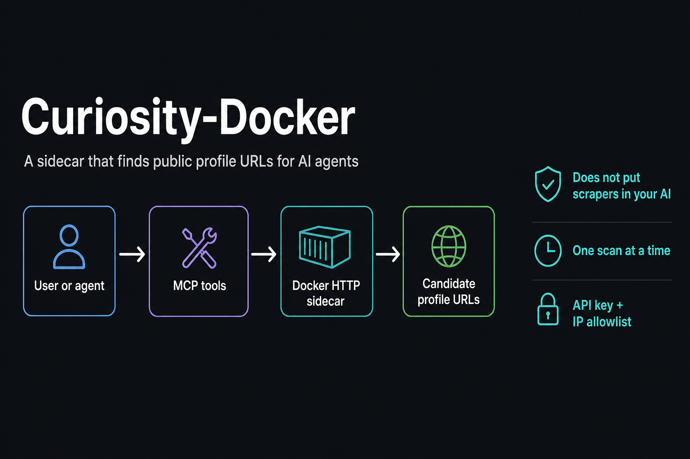

# Curiosity-Docker

**New here?** Read **[`START_HERE.md`](START_HERE.md)** first — first-use steps
for a junior Linux technician: files, configure, edit, and wire this into an
AI harness or a locally built agent.



A small **Docker sidecar** that turns a public username/handle into **candidate
social-profile URLs**, then hands those candidates to **AI agents**.

Agents should not embed a web-scraper, a browser, or an AGPL username-lookup
engine in the same process that holds their tools, memory, and credentials.
This repo is that missing worker: one authenticated HTTP service (and an MCP
adapter in front of it) whose only job is “does this handle show up on public
sites, and where?”

Clone: `git clone https://github.com/CynicalTyr/Curiosity-Docker.git`

## What this is for

Autonomous agents (and MCP-capable IDEs) often need a **structured OSINT crumb**:
given `alice`, return Instagram/X/YouTube/… URLs that *look like* that handle.
Typical uses:

- A **curiosity / research loop** that slowly enriches a local identity ledger
  so the agent knows who it is talking to.
- A **tool call** when a user says “find this handle” — the model invokes MCP
  instead of inventing URLs.
- Keeping **license and blast radius** isolated: upstream
  [social-analyzer](https://github.com/qeeqbox/social-analyzer) is AGPL-3.0 and
  is cloned **only inside the image** at a pinned git SHA. Your agent repo never
  vendors `app.py`.

What it is **not**:

- Not a people-search product, not a paid OSINT API, not a credential hunter.
- Not Selenium / Chrome. **Fast mode only** — HTTP checks, one scan at a time.
- Not proof of identity. Hits are public URL candidates. You still gate, match
  the handle to the path, and review before treating a profile as verified.

## How it connects to AI agents

```
┌─────────────────────────────────────────────────────────┐
│  Agent runtime / IDE                                     │
│  (tool loop, memory, identity store)                     │
│         │                                                │
│         │  MCP stdio (tools)                             │
│         ▼                                                │
│  examples/mcp_server.py                                  │
└─────────┬───────────────────────────────────────────────┘
          │  HTTP JSON + X-API-Key
          ▼
┌─────────────────────────────────────────────────────────┐
│  Docker: curiosity-username-discovery                    │
│  shim_server.py  GET /health  POST /scan                 │
│         │                                                │
│         ▼                                                │
│  social-analyzer (fast, in-image, AGPL)                  │
└─────────────────────────────────────────────────────────┘
```

Three integration styles, same sidecar:

| Style | When |
| ----- | ---- |
| **MCP** (recommended for chat/IDE agents) | Host launches `examples/mcp_server.py`; model calls `username_discovery_health` and `username_discovery_scan`. See [`docs/MCP.md`](docs/MCP.md). |
| **HTTP from a worker** | A scheduled Python/Go/bash job POSTs `/scan` with the API key. See [`docs/HTTP_API.md`](docs/HTTP_API.md). |
| **Both** | MCP for interactive turns; HTTP for a timer-driven curiosity sweep. Do not run overlapping scans — the sidecar returns **HTTP 503** `busy`. |

Agent-side policy that belongs in *your* loop, not in this container:

- Opt-in subjects and a platform allowlist.
- Client timeout **longer** than the container scan timeout (120s vs 60s).
- On `busy` / timeout / transport error: **stop the batch**, retry next cycle.
- Stamp “scan completed” on empty hits; do not cool down a user for 72 hours
  because the model chatted instead of returning JSON (that bug lives in the
  agent, not here).

## How it is used as MCP

The container speaks **HTTP**. MCP is a **stdio adapter** on the agent host so
Claude Desktop, Cursor, VS Code Copilot Chat, or any MCP client can load two
tools without granting the model a shell.

| Tool | Purpose |
| ---- | ------- |
| `username_discovery_health` | Is the worker up and accepting this API key? |
| `username_discovery_scan` | `username` + optional `top` → `{hits:[{platform,url,site,confidence}]}` or `{error}` |

Install the adapter (agent host only):

```bash
python3 -m pip install -r examples/requirements-mcp.txt
```

Point the host at `examples/mcp.example.json` (absolute path to
`examples/mcp_server.py`, env `USERNAME_DISCOVERY_URL` and
`USERNAME_DISCOVERY_API_KEY`). Full contract: [`docs/MCP.md`](docs/MCP.md).

Nothing except the MCP SDK may write to stdout.

## Hardware requirements

| Resource | Minimum | Practical |
| -------- | ------- | --------- |
| CPU | 1 x86_64 or aarch64 core | 2 cores; scans are many short HTTPS GETs |
| RAM | 512 MiB for the container | 1 GiB headroom on the host while a scan fans out |
| Disk | ~1.5 GiB for the image (Python slim + git clone + pip) | SSD preferred |
| GPU | **None** | Fast mode does not use CUDA or a browser |
| Network | Outbound HTTPS to public sites | Inbound only from the agent (loopback or allowlisted IP) |
| OS | Linux with Docker Engine 24+ / Compose v2 | Linux **host networking** is the LAN-agent path; Docker Desktop uses the bridge file |

Tested in production-shaped use on a **4-core Linux NAS** (Intel Celeron
J4125-class, 8–16 GiB RAM) as the sidecar host, with an **ARM Linux agent**
calling it over a private LAN. It should run anywhere the table above is met.

Do not put this on a public WAN IP. Publish **loopback** (bridge compose) or
restrict with an IP allowlist (host compose).

## Software it uses

**In the image**

| Piece | Role |
| ----- | ---- |
| `python:3.12-slim-bookworm` | Runtime |
| git + ca-certificates | Fetch pinned upstream at build |
| [qeeqbox/social-analyzer](https://github.com/qeeqbox/social-analyzer) @ `1ba0905e00d054aab833eb3693739c354db09e0f` | Fast username checks; **AGPL-3.0** — see `LICENSE.notice` |
| Upstream `requirements.txt` (installed in-image) | Analyzer Python deps |
| `shim_server.py` | stdlib `http.server` JSON facade, API key, IP gate, occupancy lock |

**On the agent host (optional MCP)**

| Piece | Role |
| ----- | ---- |
| Python 3.10+ | Launch the adapter |
| `mcp` (`examples/requirements-mcp.txt`) | FastMCP stdio server |
| urllib (stdlib) | HTTP client to the sidecar |

**Not used in v1:** Selenium, Chrome, Playwright, GPU runtimes, a public
reverse proxy.

## Quick start

```bash
git clone https://github.com/CynicalTyr/Curiosity-Docker.git
cd Curiosity-Docker
cp .env.example .env
# set USERNAME_DISCOVERY_API_KEY to a long random string
# first-time operators: follow START_HERE.md from the top

# Linux NAS / server (host network; default allowlist 127.0.0.1)
docker compose up -d --build

# Docker Desktop (Mac/Windows): loopback publish, API key only
# docker compose -f docker-compose.bridge.yml up -d --build

export USERNAME_DISCOVERY_API_KEY   # same value as .env
./scripts/smoke_health.sh
```

Remote agent on a private LAN: keep `docker-compose.yml` (host network), set
`USERNAME_DISCOVERY_ALLOWED_IPS` in `.env` to that agent’s IP (comma-separated),
then `docker compose up -d`.

## Repository layout

| Path | Role |
| ---- | ---- |
| `START_HERE.md` | First-use guide (edit, configure, harness + local AI) |
| `docs/hero.png` | Banner: what the stack does for agents and users |
| `Dockerfile` | Build image, pin analyzer SHA |
| `docker-compose.yml` | Linux/NAS: host network |
| `docker-compose.bridge.yml` | Desktop: `127.0.0.1:8095` |
| `shim_server.py` | HTTP `/health` and `/scan` |
| `examples/mcp_server.py` | MCP stdio adapter |
| `examples/mcp.example.json` | Host config template |
| `docs/HTTP_API.md` | Status codes and client kinds |
| `docs/MCP.md` | Tools, install, agent policy |
| `.env.example` | Variable **names** only |

## HTTP summary

| Method | Path | Success |
| ------ | ---- | ------- |
| GET | `/health` | `{"status":"ok","mode":"fast"}` |
| POST | `/scan` | `{"username","hits":[…]}` (`hits` may be `[]`) |

Header: `X-API-Key`. Occupancy: **503** `{"error":"busy"}`. Details:
[`docs/HTTP_API.md`](docs/HTTP_API.md).

## Security

- API key is required. Empty key → process exits.
- IP allowlist defaults to `127.0.0.1`. `*` disables the IP check (bridge file
  only; still require the key and loopback publish).
- `X-Forwarded-For` is **ignored** unless `USERNAME_DISCOVERY_TRUST_FORWARDED=1`
  behind a proxy you control.
- Do not map upstream UI port 9005. Do not expose 8095 on the internet.
- One concurrent scan. Agents must back off on 503.
- Rotate the key on **both** the container `.env` and the MCP/agent env, then
  recreate the container.

## Rebuild vs bind-mount

| Change | Action |
| ------ | ------ |
| `shim_server.py` | Already bind-mounted; `docker compose restart` if needed |
| Compose / `.env` | `docker compose up -d` |
| `Dockerfile` or SHA | `docker compose build && docker compose up -d` |

## Operator gates (before you let an agent loose)

1. Write down which platforms you will accept and who may be scanned.
2. Review the first batch of hits before writing them into long-term memory.
3. Keep the sweep **opt-in** until that review exists.
4. Budget scans per cycle; this worker will not do it for you.

## License notes

Upstream social-analyzer is **AGPL-3.0** and is present in the running image.
If you modify that component and offer the service over a network, AGPL source
obligations apply to that component. Keep it inside the container; do not copy
it into agent trees. See `LICENSE.notice`.
